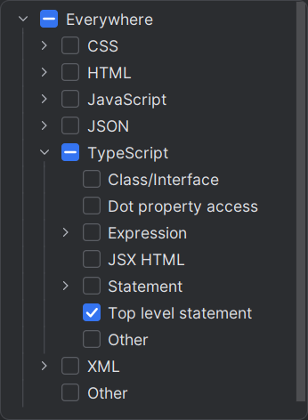
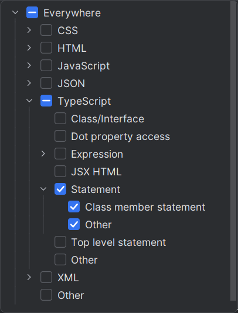

# WebStorm Snippets for React Development

> [!NOTE]
> Allman brace style approach is used.

A collection of handy WebStorm snippets to speed up React component creation, including both client and server components with and without props.

## Table of Contents

- [React Client Component](#react-client-component)
- [React Client Component with Props](#react-client-component-with-props)
- [React Server Component](#react-server-component)
- [React Server Component with Props](#react-server-component-with-props)
- [React Action Handler](#react-action-handler)
- [Applicable Contexts](#applicable-contexts)

---

## React Client Component

`rcc`

Basic client-side React component template.

**Snippet:**

```tsx
"use client"

import React from "react"

function $TM_FILENAME_BASE$()
{
    return (
        <div>
            $END$
        </div>
    )
}

export default $TM_FILENAME_BASE$

```

**Variables:**

| Name             | Expression                                          | Default value |
| ---------------- | --------------------------------------------------- | ------------- |
| TM_FILENAME_BASE | `capitalize(camelCase(fileNameWithoutExtension()))` | ""            |

[⬆️ back to top](#webstorm-snippets-for-react-development)

---

## React Client Component with Props

`rccp`

Client-side component template with typed props interface.

**Snippet:**

```tsx
"use client"

import React from "react"

interface I$TM_FILENAME_BASE$Props
{
    $END$
}

function $TM_FILENAME_BASE$({
    // Tabulation to here
}: I$TM_FILENAME_BASE$Props)
{
    return (
        <div>
            {/* Tabulation to here */}
        </div>
    )
}

export default $TM_FILENAME_BASE$

```

**Variables:**

| Name             | Expression                                          | Default value |
| ---------------- | --------------------------------------------------- | ------------- |
| TM_FILENAME_BASE | `capitalize(camelCase(fileNameWithoutExtension()))` | ""            |

[⬆️ back to top](#webstorm-snippets-for-react-development)

---

## React Server Component

`rsc`

Server-side component without props, for static or data-fetching use cases.

**Snippet:**

```tsx
import React from "react"

function $TM_FILENAME_BASE$()
{
    return (
        <div>
            $END$
        </div>
    )
}

export default $TM_FILENAME_BASE$

```

**Variables:**

| Name             | Expression                                          | Default value |
| ---------------- | --------------------------------------------------- | ------------- |
| TM_FILENAME_BASE | `capitalize(camelCase(fileNameWithoutExtension()))` | ""            |

[⬆️ back to top](#webstorm-snippets-for-react-development)

---

## React Server Component with Props

`rscp`

Server-side component with props interface for more complex static or server-rendered UIs.

**Snippet:**

```tsx
import React from "react"

interface I$TM_FILENAME_BASE$Props
{
    $END$
}

function $TM_FILENAME_BASE$({
    // Tabulation to here
}: I$TM_FILENAME_BASE$Props)
{
    return (
        <div>
            {/* Tabulation to here */}
        </div>
    )
}

export default $TM_FILENAME_BASE$

```

**Variables:**

| Name             | Expression                                          | Default value |
| ---------------- | --------------------------------------------------- | ------------- |
| TM_FILENAME_BASE | `capitalize(camelCase(fileNameWithoutExtension()))` | ""            |

[⬆️ back to top](#webstorm-snippets-for-react-development)

---

## React Action Handler

`rah`

Simple snippet for creating a reusable event handler function.

**Snippet:**

```tsx
function handle$NAME$()
{
    $END$
}
```

**Variables:**

| Name | Expression | Default value |
| ---- | ---------- | ------------- |
| NAME |            |               |

[⬆️ back to top](#webstorm-snippets-for-react-development)

---

## Applicable Contexts

_This section outlines where each snippet is intended to be used within a TypeScript/React code file in WebStorm._

- ### Component Snippets (`rcc`, `rccp`, `rsc`, `rscp`)

    These snippets should be used at the top level of your TypeScript React files, where components are typically declared.

    

- ### Function Snippet (`rah`)

    This snippet is designed to be used within a function or method body, where you'd typically define event handlers or other logic.

    

[⬆️ back to top](#webstorm-snippets-for-react-development)
